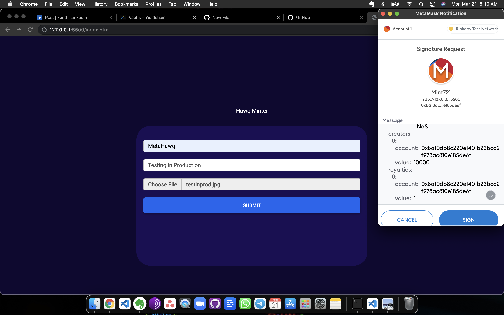
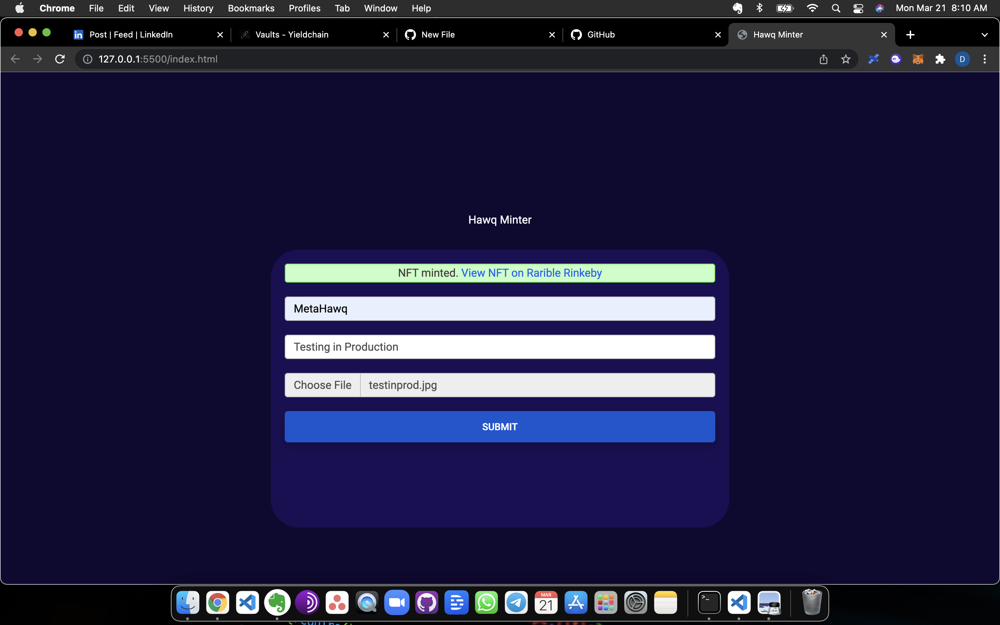
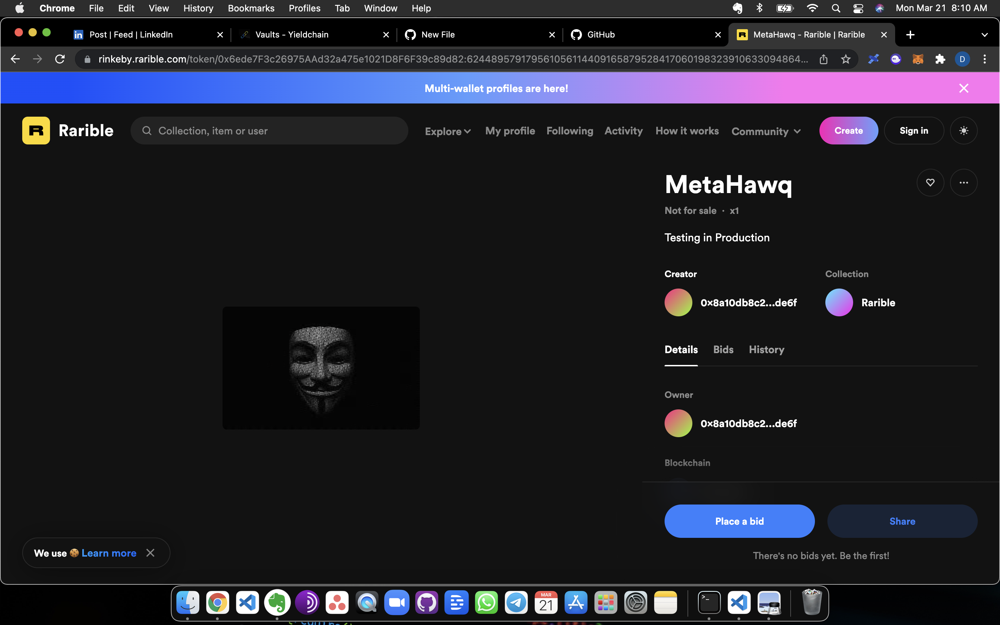

# hawqminter

## Deploy on Rarible Rinkeby Testnet Ethereum

Steps to run the application in your local machine:-

* Clone this repo:
* 
```text
git clone https://github.com/MetaHawq/hawqminter.git
```

* Open IDE, Open with Live Server if you are in VS Code

* Upload file and deploy


-

-

